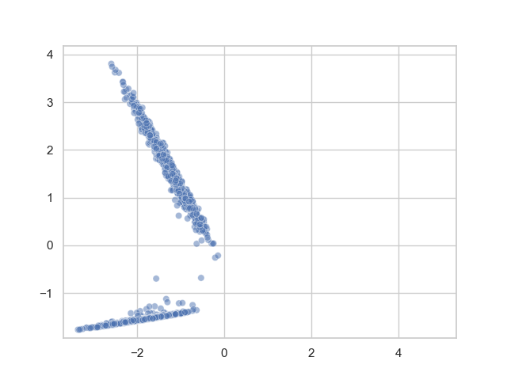
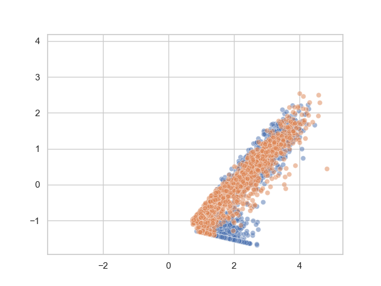
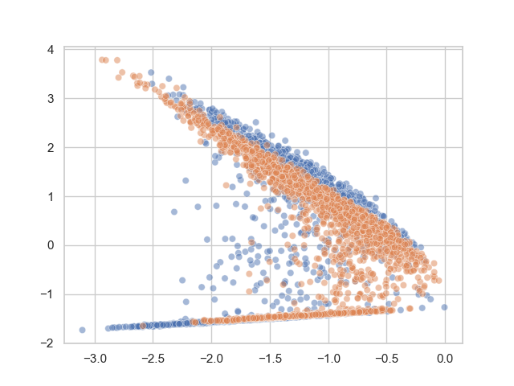

# Target Layer Regularization for Continual Learning Using Cramer-Wold Distance (CW-TaLaR)

## Repository info

This repository contains an implementation of `Target Layer Regularization for Continual Learning Using Cramer-Wold Distance` in PyTorch, proposed by Marcin Mazur, Łukasz Pustelnik, Szymon Knop, Patryk Pagacz, Przemysław Spurek.

## Contents of the repository

```text
|-- src/ - contains an implementation of the scenario described in Figure 2 in the paper allowing to reproduce the experiment from the original paper
|---- architectures/ - files containing architectures proposed in the paper
|---- data/ - factories used to create datasets and dataloaders
|---- metrics/ - implementation of metrics reported in experiments
|---- lighting_modules/ - implementation of experiments in pytorch lightning
|---- trainer/ - directory containing the implementation of training procedure
|---- figure2_experiment.py - code that allows to reproduce the experiment from Figure 2
|-- data/ - default directory that will be used as a source of data and place to download datasets
```

## Conducting the experiments

Below there is simple script that runs the experiment. Navigate to `src` directory first.

`python .\figure2_experiment.py`

Plots will be automatically displayed.





# Datasets

The repository uses a default dataset provided by PyTorch for MNIST.

# Environment

- python3
- pytorch
- torchvision
- numpy
- matploblib
- seaborn

# License

This implementation is licensed under the MIT License